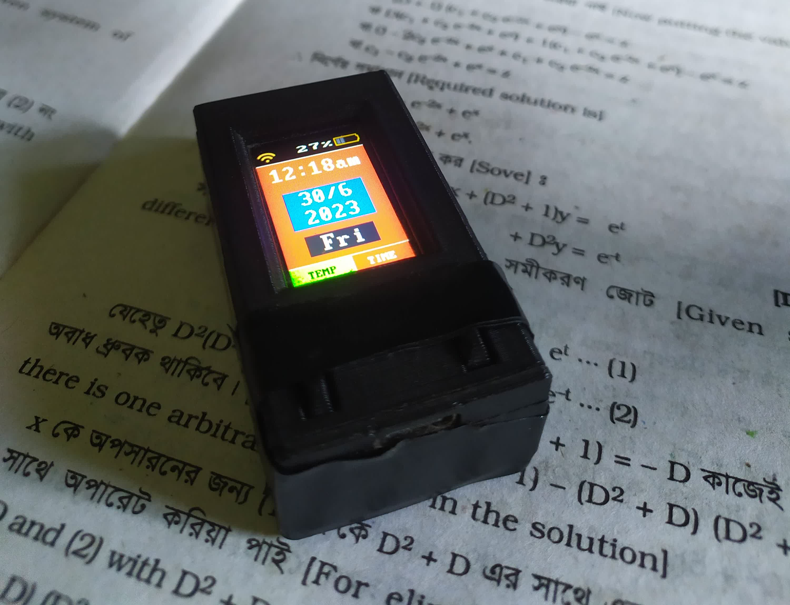
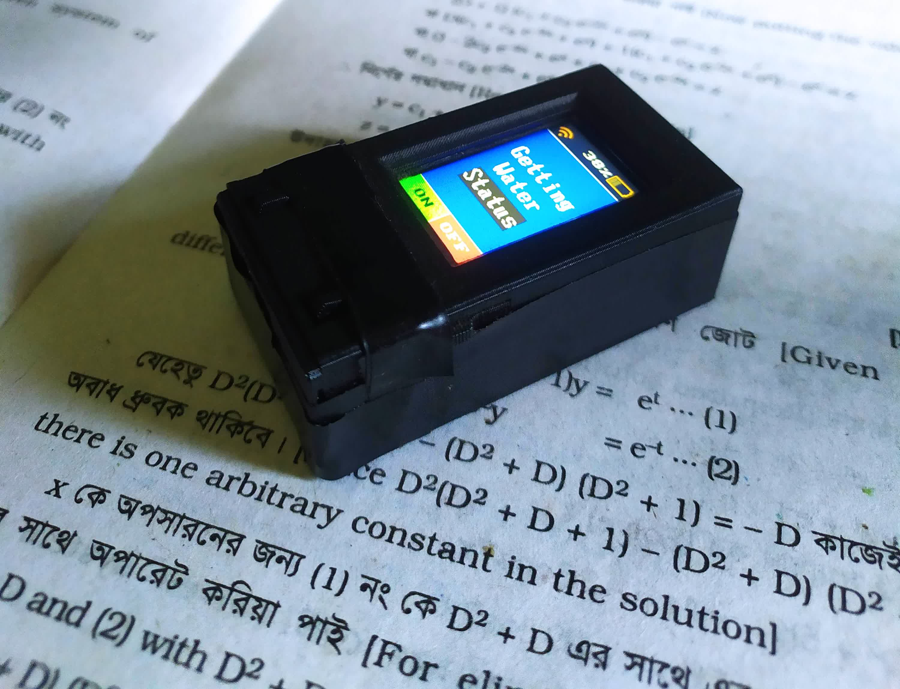
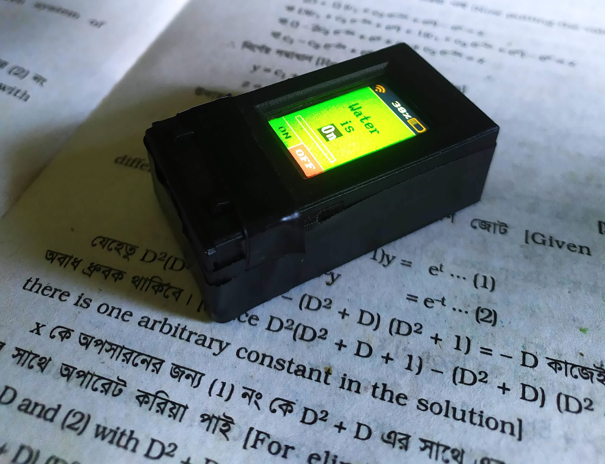
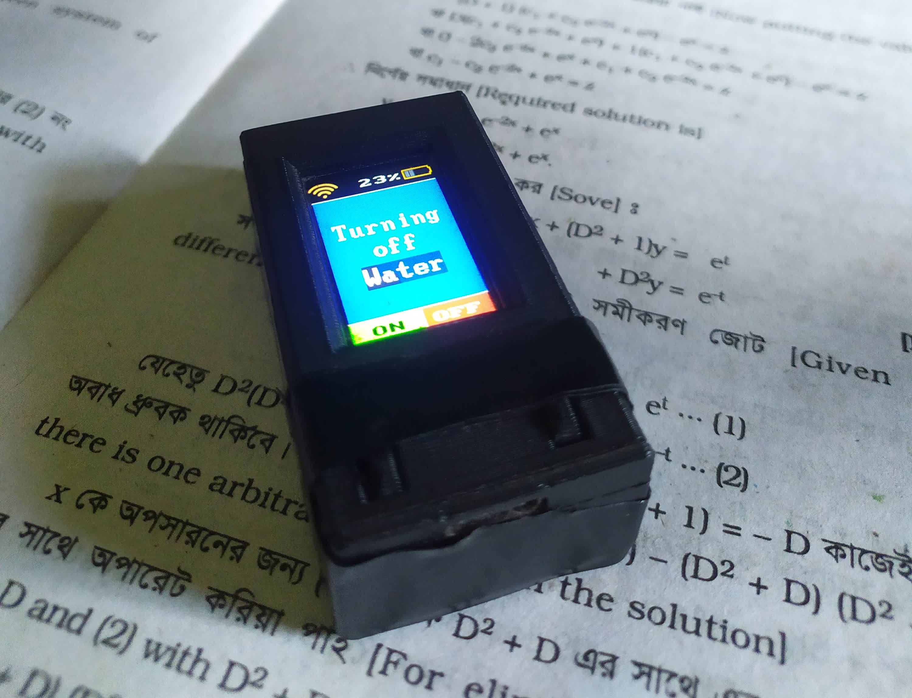
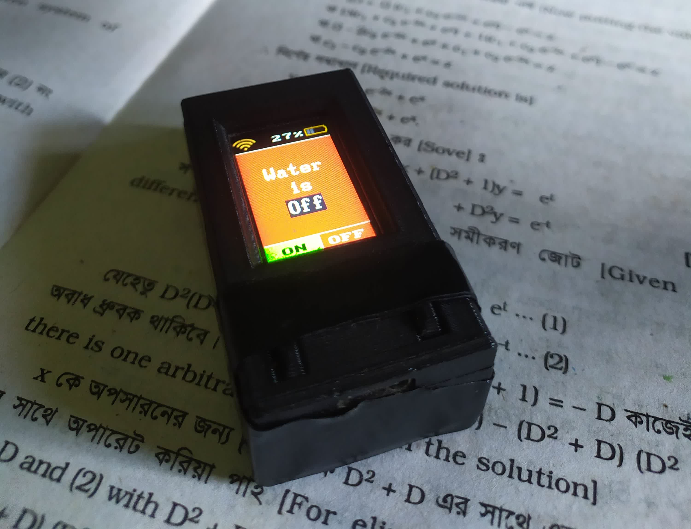
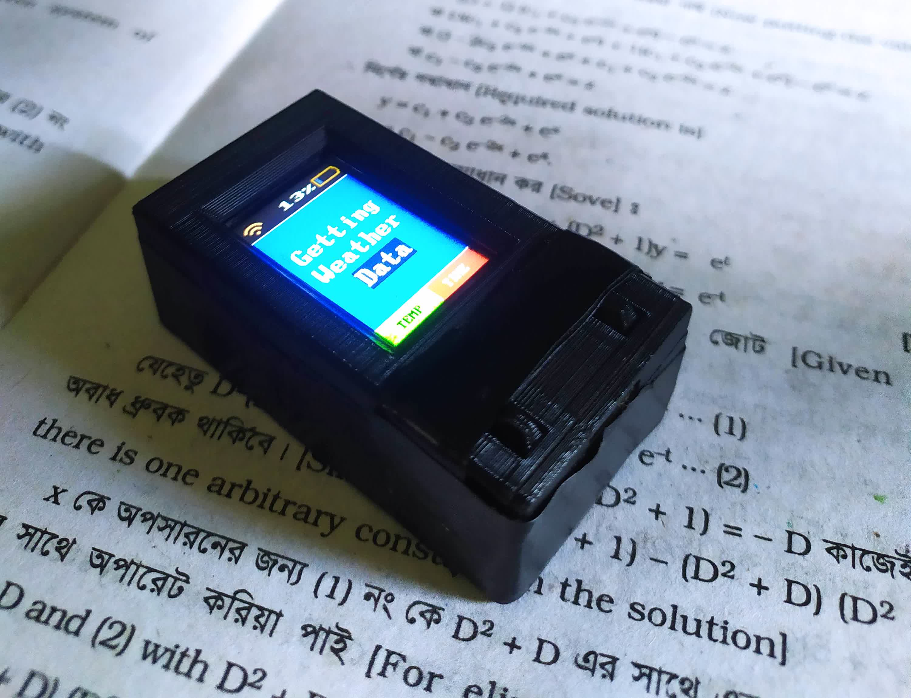
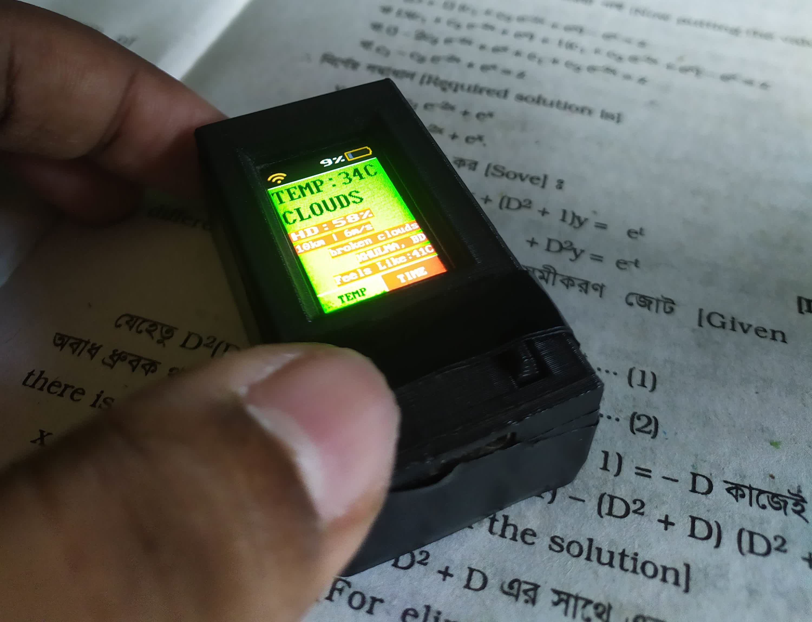
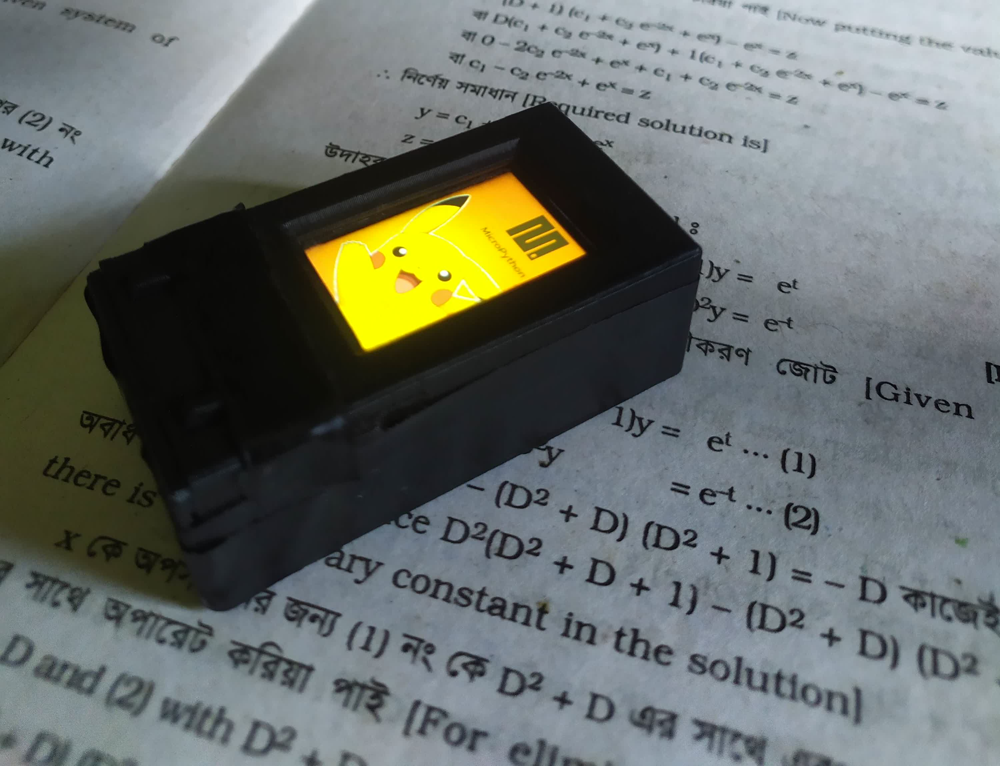
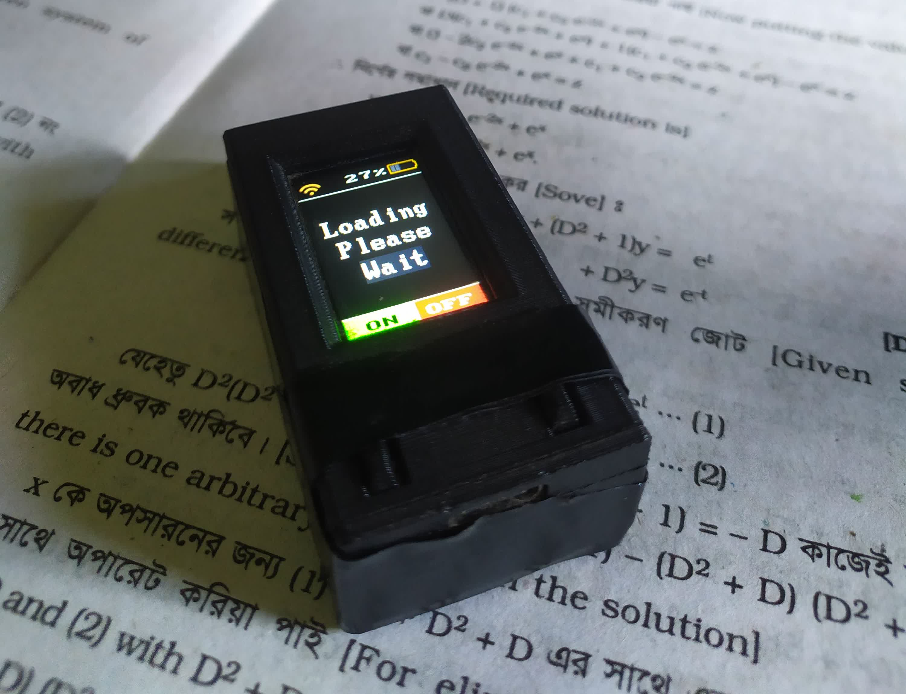

# Smart_Switch_IoT
This is a project that uses UDP packets and a TTGO T-Display device to control a Xiaomi smart plug locally. The project allows users to easily turn the smart plug on and off from within their local WiFi network using the TTGO T-Display device, as well as view weather information and the current time.

## Requirement
### Create A file named `CONFIG.py` file inside the `src` folder and edit the values accordingly.
```python
SSID = 'ssid'
PASSWORD = 'password'
DEVICE_NAME = b'0X0X0X0X'
DEVICE_TOKEN = '0X0X0X0X0X0X0X0X0X0X0X0X0X0X0X0X'
TEMP_URL = 'http://api.openweathermap.org/data/2.5/weather?(X0)*'
```

## Button Functions
The TTGO T-Display features two programmable buttons that have been customized to provide additional functionality for the project. These button functions are as follows:
- Left button:
    - Single press: Show weather information
    - Double press: Display the on/off status of the smart plug
    - Long press: Turn on the smart plug

- Right button:
    - Single press: Show the current time
    - Double press: Display the on/off status of the smart plug
    - Long press: Turn off the smart plug

## Smart Plug Control
The smart plug is controlled by programming the TTGO T-Display to send UDP packets to the smart plug's IP address and port number, which triggers the plug to turn on or off accordingly. The device also features a user-friendly interface that displays the current status of the plug, making it easy to monitor and control the plug within the local WiFi network.

This project supports only the `Xiaomi Chuangmi M1 Wifi plug`.

## Protocol Documentation
This project is based on the documentation provided by OpenMiHome. See https://github.com/OpenMiHome/mihome-binary-protocol,  for details.

## Frimware Used
https://github.com/ShantoNoor/st7789_mpy/tree/master/firmware/T-DISPLAY-ESP32

## 3D Case from Thingiverse
https://www.thingiverse.com/thing:4183337/files?fbclid=IwAR2CsQEQLWAu_kNyvLkpR-6B2rZvMJDSHORbxbR59HeHZKB4lwv_PN-y154

# Some Images











